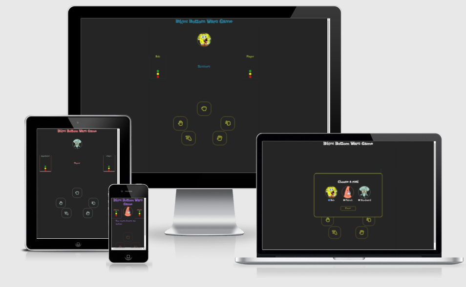
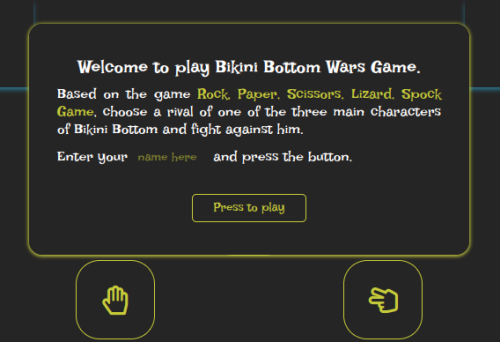
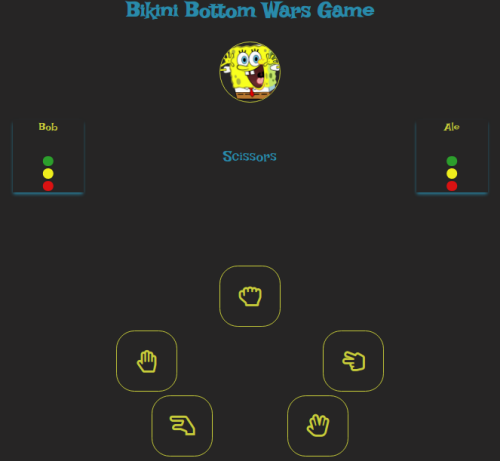
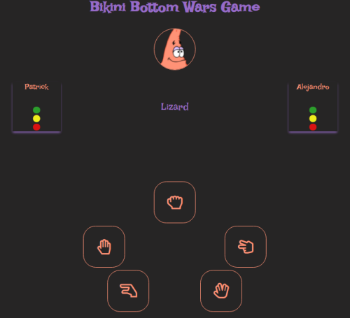
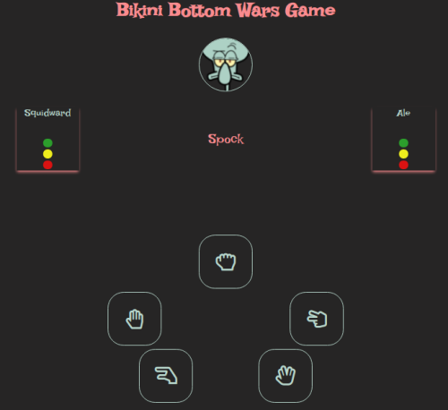
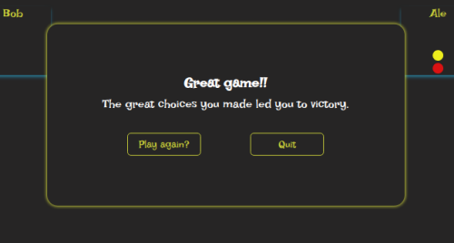
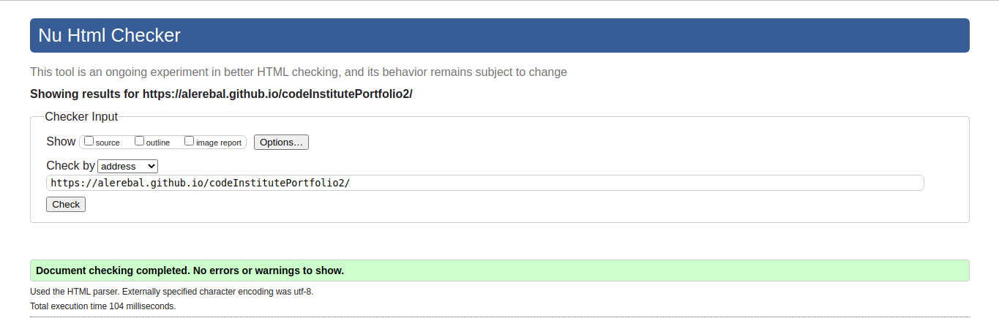
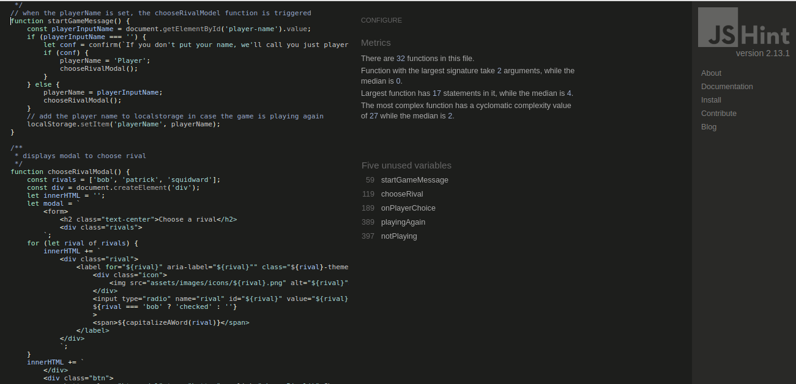
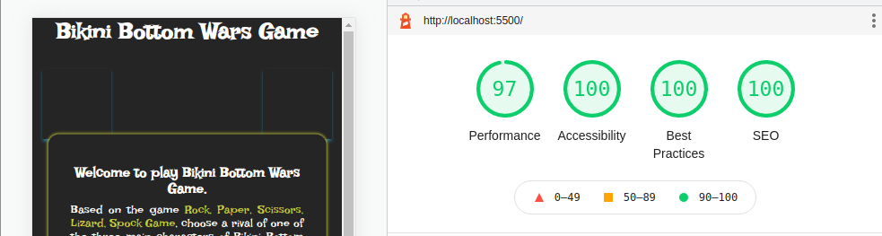
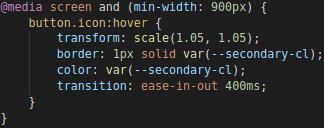

# Bikini Bottom Wars Game

This page has been designed for any user who likes the traditional game Rock, Paper, Scissors and wants to discover the version of the game with extended functions for the fans of Stars Wars. Here the player chooses to play against a Bikini Bottom Show character.

[Rock, Paper, Scissors, Lizard, Spock](https://www.instructables.com/How-to-Play-Rock-Paper-Scissors-Lizard-Spock/) is an extension of the classic game of chance, Rock, Paper, Scissors, created by Sam Kass and Karen Bryla

## Features

The first modal that is shown to the player is that they choose their name and start to play. 

If they do not choose one, an alert(confirm alert) will be displayed to indicate that they will simply be called 'Player' in the game.

The second modal is for player to choose a rival. There are three different options: SpongeBob, Patrick star and Squidward. Spongebob is selected by default.

#### Each of them has a different theme color.

Once the player chooses an opponent, the game begins. A countdown is started using the words of the game and when it ends the first battle is defined. 

The player must choose an option during this countdown, if not, the countdown starts again and a message is displayed to the player.

If the player chose an option, it is compared to the computer's choice to determine who is the winner of that battle. 

The first to get 3 battles wins the game.

The final modal is shown to allow the player to play again or quit the game.

## Features Left to Implement

- It would be nice if the game can be played between two friends. So a feature that would allow them to play together would be the next step in the game.
- I will need to put the game on a server and give it some functionality to allow each player to choose between playing against a friend or against the computer.

## Testing

### Validator Testing

#### HTML

- No errors were returned when passing through the official [W3C validator](https://validator.w3.org/nu/)

#### CSS

- No errors were found when passing through the official [Jigsaw validator](https://jigsaw.w3.org/css-validator)

##### Gave me some warnings about variables

#### JS

- No errors were found when passing through the official [JsHint validator](https://jshint.com/)

##### Detects 5 unused variables. They are functions that I have used within other functions.

### Lighthouse Testing

## Bugs

### Option was not caught by the function
If the player chose an option before the countdown begins, during the game status message, this option was not received by the function that has to do it and the game could not be played.

What I did was hide the option buttons during that part of the game. I moved the displayButtons function to the startGame function and the problem was solved.

### Buttons remained as hover after has been selected
In screens smaller than 900px, the option buttons remained as hover after their has been selected. 

What I did was add a media query for screens bigger than 900px and add the hover feature inside of it.

## Deployment

- This site has been deployed on GitHub pages by following these steps:
    - In the GitHub repository, navigate to the Settings tab and in the left menu select Pages.
    - From the source section drop-down menu, select the Master Branch.
    - Once the master branch has been selected, the page will be automatically refreshed with a detailed ribbon display to indicate the successful deployment.
    - A link to the newly created page will be displayed here.

[Here you can see the page](https://alerebal.github.io/codeInstitutePortfolio2)  

## Resources

### Content 

#### The images of the Bikini Bottom characters were taken from

PNGITEM - https://www.pngitem.com/

#### The option buttons images are from 

Font Awesome - https://fontawesome.com/
