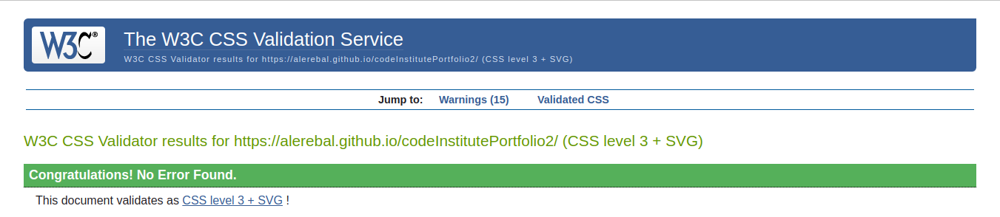

# Bikini Bottom Wars Game

Based on the [Rock, Paper, Scissors, Lizard, Spock game](https://www.instructables.com/How-to-Play-Rock-Paper-Scissors-Lizard-Spock/), the player chooses to play against a SpongeBob show character.

## Features

The first modal that is shown to the player is that they choose their name and start to play. 

If they do not choose one, an alert(confirm alert) will be displayed to indicate that they will simply be called 'Player' in the game.

The second modal is for player to choose a rival. There are three different options: SpongeBob, Patrick star and Squidward. Each of them has a different theme color. Spongebob is selected by default.

Once the player chooses an opponent, the game begins. A countdown is started using the words of the game and when it ends the first battle is defined. 

The player must choose an option during this countdown, if not, the countdown starts again and a message is displayed to the player.

If the player chose an option, it is compared to the computer's choice to determine who is the winner of that battle. 

The first to get 3 battles wins the game.

The final modal is shown to allow the player to play again or quit the game.

## Testing

### Validator Testing

#### HTML

- No errors were returned when passing through the official [W3C validator](https://validator.w3.org/nu/)

#### CSS

- No errors were found when passing through the official [Jigsaw validator](https://jigsaw.w3.org/css-validator)

#### JS

- No errors were found when passing through the official [JsHint validator](https://jshint.com/)
- Detects 5 unused variables. They are functions that I have used within other functions.

### Lighthouse Testing

## Deployment

- This site has been deployed on GitHub pages by following these steps:
    - In the GitHub repository, navigate to the Settings tab and in the left menu select Pages.
    - From the source section drop-down menu, select the Master Branch.
    - Once the master branch has been selected, the page will be automatically refreshed with a detailed ribbon display to indicate the successful deployment.
    - A link to the newly created page will be displayed here.

[Here you can see the page](https://alerebal.github.io/codeInstitutePortfolio2)  
